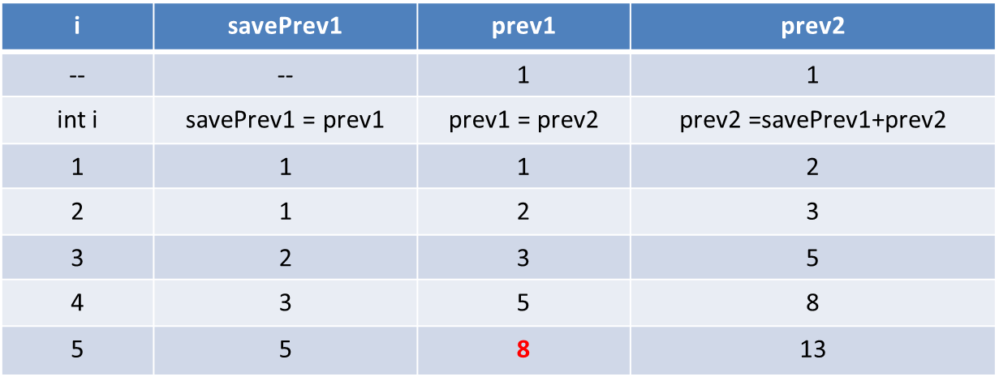
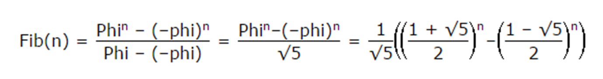
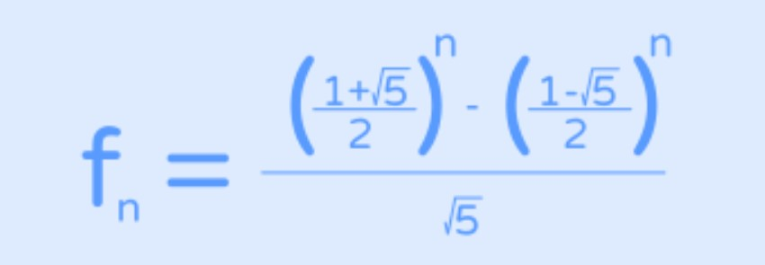

# Lecture 3 Algorythm analysis
(Adapted from Data Structures and Algorithm & Data Structures And Problem Solving Using Java)

The amount of time that any algorithm takes to run almost always depends on the amount of input that it must process. We expect, for instance, that sorting 10,000 elements requires more time than sorting 10 elements. The running time of an algorithm is thus a function of the input size. The exact value of the function depends on many factors, such as the speed of the host machine, the quality of the compiler, and in some cases, the quality of the program.

## Example 1: 
Consider a simple algorithm to solve the problem of finding the largest value (the max value) in an array of n integers. 

The algorithm looks at each integer in turn, saving the position of the largest value seen so far.

The total time to run this algorithm is approximately **cn**, because we must make **n** comparisons, with each comparison costing **c** time.
Then for this algorithm *T(n) = cn*

For a given input size **n** we often express the time **T** to run the algorithm as a function of **n**, written as **T(n)**.

## Example 2:
Consider a simple algorithm to solve the problem of finding the largest value (the max value) in an array of n integers. 

The algorithm looks at each integer in turn, saving the position of the largest value seen so far.

Then for this algorithm T(n) = cn

An algorithm with running time T(n) = **n<sup>2</sup>** for an input of size 1024 (n = 1024) requires 1024 × 1024 = 1,048,576 time steps. 

An algorithm with running time T(n) = **nlog<sub>2</sub>n** for the same input of size n = 1024 requires 1024 × 10 = 10,240 time steps .

It’s easy to verify that **n<sup>2</sup>**  > **nlog<sub>2</sub>n** when n > 1.

## Big-O notation
(Adapted from https://github.com/kodecocodes)

Big-O notation gives you a rough indication of the worst running time of an algorithm and the amount of memory it uses. When someone says, "This algorithm has worst-case running time of **O(n<sup>2</sup>)** and uses **O(n)** space," they mean it's kinda slow but doesn't need lots of extra memory.

Figuring out the Big-O of an algorithm is usually done through mathematical analysis. **n** refers to the number of data items that you're processing. 

Big-O | Name | Description
------| ---- | -----------
**O(1)**    | constant | **This is the best.** The algorithm always takes the same amount of time, regardless of how much data there is. Example: looking up an element of an array by its index.
**O(log n)** | logarithmic | **Pretty great.** These kinds of algorithms halve the amount of data with each iteration. If you have 100 items, it takes about 7 steps to find the answer. With 1,000 items, it takes 10 steps. And 1,000,000 items only take 20 steps. This is super fast even for large amounts of data. Example: binary search.
**O(n)** | linear | **Good performance.** If you have 100 items, this does 100 units of work. Doubling the number of items makes the algorithm take exactly twice as long (200 units of work). Example: sequential search.
**O(n log n)** | "linearithmic" | **Decent performance.** This is slightly worse than linear but not too bad. Example: the fastest general-purpose sorting algorithms.
**O(n<sup>2</sup>)** | quadratic | **Kinda slow.** If you have 100 items, this does 100<sup>2</sup> = 10,000 units of work. Doubling the number of items makes it four times slower (because 2 squared equals 4). Example: algorithms using nested loops, such as insertion sort.
**O(n<sup>3</sup>)** | cubic | **Poor performance.** If you have 100 items, this does 100<sup>3</sup> = 1,000,000 units of work. Doubling the input size makes it eight times slower. Example: matrix multiplication.
**O(2<sup>n</sup>)** | exponential | **Very poor performance.** You want to avoid these kinds of algorithms, but sometimes you have no choice. Adding just one bit to the input doubles the running time. Example: traveling salesperson problem.
**O(n!)** | factorial | **Intolerably slow.** It literally takes a million years to do anything.  


Below are some examples for each category of performance:

**O(1)**

  The most common example with O(1) complexity is accessing an array index.

  ```java
  int n = array[5]
  ```

  Another example of O(1) is pushing and popping from Stack.


**O(log n)**

  ```java
 public class Ologn
{
    public static void main(String args[])
    {
        int n = 3;
        for (int j= 1; j < n; j*= 2) 
        {      
       
            // do constant time stuff
            System.out.println( j );
        }
    }
}
  ```  

  Instead of simply incrementing, 'j' is increased by 2 times itself in each run.

  Binary Search Algorithm is an example of O(log n) complexity.


**O(n)**

  ```java
public class On 
{
    public static void main(String args[])
    {
        int n = 3;
        for (int i = 0; i < n; i = i + 1) 
        {
            System.out.println(i);
        }
    }
}
  
  ```

  Array Traversal and Linear Search are examples of O(n) complexity.  


**O(n log n)**

  ```java
  
class OnlognWhile
{
    public static void main(String args[])
    {
        int n = 3;
        for (int i = 0; i < n; i++) 
        {   
            int j = 1;
            while (j < n) 
            {
                j *= 2;
                // do constant time stuff
                System.out.println(i + "," + j);
            }
        }
    }
}
  ```

  OR

  ```java
    
class Onlogn
{
    public static void main(String args[])
    {
        int n = 3;
        for (int i = 0; i < n; i++) 
        {     
            for (int j= 1; j < n; j*= 2) 
            {      
           
                // do constant time stuff
                System.out.println(i + "," + j );
            }
        }
    }
}
  
  ```

  Merge Sort and Heap Sort are examples of O(n log n) complexity.  


**O(n<sup>2</sup>)**

  ```java
class On2
{
    public static void main(String args[])
    {
        int n = 3;
        for (int i = 0; i < n; i++) 
        {     
            for (int j= 0; j < n; j++) 
            {      
           
                    // do constant time stuff
                    System.out.println(i + "," + j );
            }
        }
    }
}
  ```

  Traversing a simple 2-D array and Bubble Sort are examples of O(n<sup>2</sup>) complexity.


**O(n<sup>3</sup>)**

  ```java
class On3
{
    public static void main(String args[])
    {
        int n = 3;
        for (int i = 0; i < n; i++) 
        {     
            for (int j= 0; j < n; j++) 
            {      
            for (int k= 0; k < n; k++) 
            {
            
                    // do constant time stuff
                    System.out.println(i + "," + j + "," + k);
            }
            }
        }
    }
}
  ```  

**O(2<sup>n</sup>))**

  Algorithms with running time O(2<sup>n</sup>) are often recursive algorithms that solve a problem of size N by recursively solving smaller problems of size N-1.
  The following example prints all the moves necessary to solve the famous "Towers of Hanoi" problem for N disks.

  ```java
// JAVA recursive function to
// solve tower of hanoi puzzle
class GFG 
{
    static void towerOfHanoi(int n, char from_rod,
                             char to_rod, char aux_rod)
    {
        if (n == 0) 
        {
            return;
        }
        towerOfHanoi(n - 1, from_rod, aux_rod, to_rod);
        System.out.println("Move disk " + n + " from rod "
                           + from_rod + " to rod "
                           + to_rod);
        towerOfHanoi(n - 1, aux_rod, to_rod, from_rod);
    }
 
    // Driver code
    public static void main(String args[])
    {
        int N = 3;
 
        // A, B and C are names of rods
        towerOfHanoi(N, 'A', 'C', 'B');
    }
}
```

**O(n!)**

  The most trivial example of function that takes O(n!) time is given below.

  ```java
class UselessFunction 
{
     static void SuckyFunction(int n)
    {
        if (n == 0) 
        {
            return;
        }
        for (int i = 0; i < n; i++) 
        {
            // do constant time stuff
            System.out.println(n + ": " + n);
            SuckyFunction(n-1);
        }      
        
    }

     // Driver code
    public static void main(String args[])
    {
        int N = 3;
        SuckyFunction(N);
       
    }
}
  ```

Often you don't need math to figure out what the Big-O of an algorithm is but you can simply use your intuition. If your code uses a single loop that looks at all **n** elements of your input, the algorithm is **O(n)**. If the code has two nested loops, it is **O(n<sup>2</sup>)**. Three nested loops gives **O(n<sup>3</sup>)**, and so on.

Note that Big-O notation is an estimate and is only really useful for large values of **n**. For example, the worst-case running time for the insertion sort algorithm is **O(n<sup>2</sup>)**. In theory that is worse than the running time for merge sort, which is **O(n log n)**. But for small amounts of data, insertion sort is actually faster, especially if the array is partially sorted already!

# Estimating the Running Time for a Program

Lets assume you have a code to calculate the sum of all the cubes of all values from 0 to n. We will attempt to calculate the code by hand to define its running time in big Notation.
```java
0 public static int sum(int n) {
1    int partialSum = 0;
2    for (int i = 0; i < n; i++) 
3    {
4        partialSum += i * i * i;
5    }
6    return partialSum;
7 }
```
* We assume that the declarations count for no time.
* Lines 1 and 5 count for one unit each.
* Line 4 counts for four units, which is executed N times, so 4N.
* Line 2 has the costs of initializing *i*, testing *i* <= N, and incrementing *i*. The total cost of all there is 1 to initialize, N+1 for all the tests and N for all the increments, which is 2N+2.

If  we ignore all the costs of calling the method and returning, we have a total of 6N + 4. Thus, we say that **this method is O(N)**.

Notice how the biggest value is the one reported.

If T(N) = 10logN + 5(logN)<sup>3</sup> + 7N + 3N<sup>2</sup> + 6N<sup>3</sup>, then T(N) is O(N<sup>3</sup>). 

## General rules


* ### Rule 1 -- For loops
    The running time of a for loop is at most the running time of the statements inside the for loop (including tests) times the number of iterations.

* ### Rule 2—Nested loops
    The total running time of a statement inside a group of nested loops is the running time of the statement multiplied by the product of the sizes of all the loops.

* ### Rule 3—Consecutive Statements.
    These just add. 

* ### Rule 4 - if/else.
    For the fragment: 
    ```java
		if( condition )
		     S1
		else
		     S2
    ```
    The running time never more than the running time of the test plus the larger of the running times of S1 and S2.


## Example of Nested Loops  

Calculate Sum = 1 + 2 +…+ N

Algorithm A
```java 
public static int Sum1( int N )
 {
   int Sum = 0;
   for( int i = 0;  i < N; i++ )
       for( int j = i; j < N; j++ )
           Sum += 1;
   return Sum;
}    
```
Complexity **T(n) = O(n<sup>2</sup>)**

Algorithm B
```java
public static int Sum2( int N )
{
    int Sum = 0;
    for( int i = 0;  i < N; i++ )
         Sum += i;
    return Sum;
}    
```
Complexity **O(n)**

Algorithm C
 
```java
public static int Sum3( int N )
{
   return (N*(N+1))/2;
}    
```
Complexity **O(1)**


## Challenges of Experimental Analysis

While experimental studies of running times are valuable, especially when finetuning production-quality code, there are three major limitations to their use for
algorithm analysis:

* Experimental running times of two algorithms are difficult to directly compare unless the experiments are performed in the same hardware and software
environments.
* Experiments can be done only on a limited set of test inputs; hence, they leave out the running times of inputs not included in the experiment (and
these inputs may be important).
* An algorithm must be fully implemented in order to execute it to study its running time experimentally.

This last requirement is the most serious drawback to the use of experimental studies.

At early stages of design, when considering a choice of data structures or algorithms, it would be foolish to spend a significant amount of time implementing an approach that could easily be deemed inferior by a higher-level analysis.

## Practice Problem

Find the fibonacci number at step n.

Recursive Approach:

```java
public static long fibRec( int n )
{
	if( n <= 2 )
	 	return 1;
	else
		return fibRec( n - 1 ) + fib( n - 2 );
}
```
But while elegant, this algorithm is extremely inefficient: O(2<sup>n</sup>).


Iterative Approach:

```java
public static long fibIte( int n)
{ 
    int savePrev1;
    int prev1 = 1, prev2 = 1; 
    for(int i = 2; i < n; i++)
    { 
        savePrev1 = prev1; 
        prev1 = prev2; 
        prev2 = savePrev1 + prev2;
    } 
    return prev1; 
}
```
It’s not elegant but efficient: O(n). 




Can we do betteR?

Using Binet's Formula for the nth Fibonacci number:




But…
This formula involves square roots and powers of Phi (an irrational number)…

Lets try with a simplified formulae:



```java
public static int fibBin ( int n )
{
    //simplified formulae
	return Math.pow(((1+Math.sqrt(5))/2), n)/Math.sqrt(5);
	
}
```
Supper efficient: O(1).
